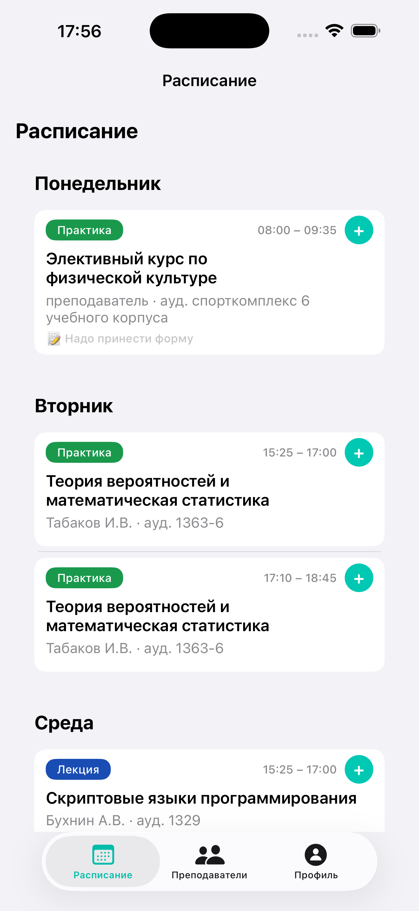
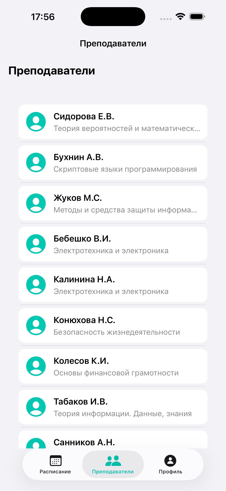
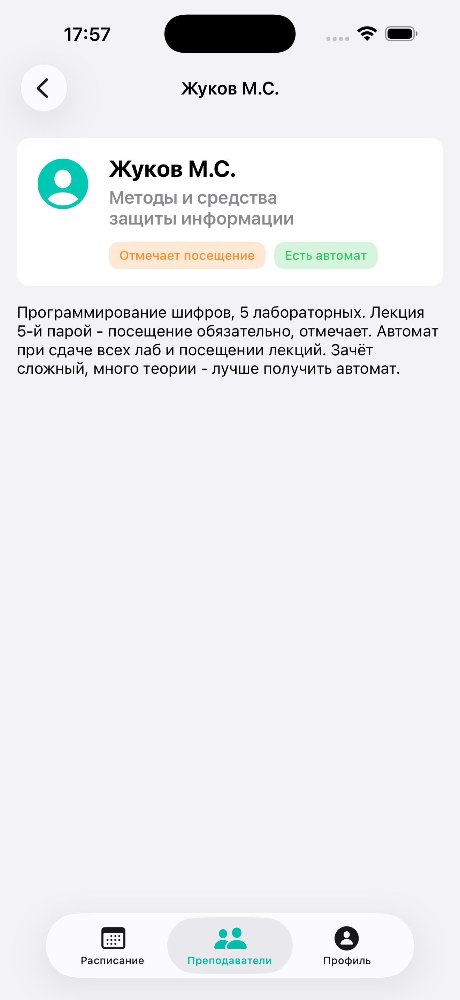
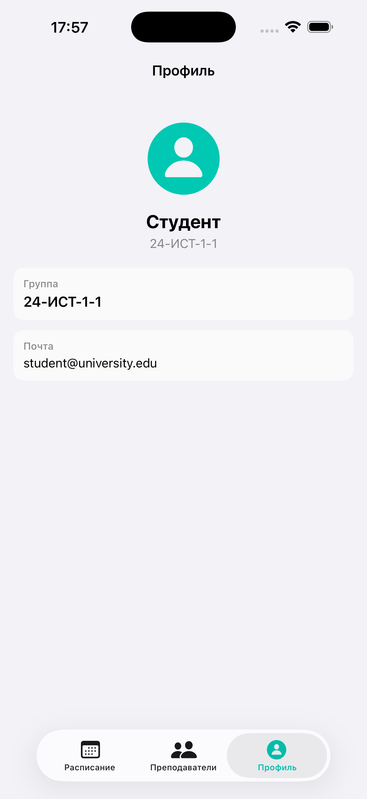

# Документация проекта Schedule


**Версия документа:** 1.0  
**Дата актуализации:** 19 февраля 2026 г.

---

## Скриншоты

| Расписание | Список преподавателей | Карточка преподавателя | Профиль |
| :---: | :---: | :---: | :---: |
|  |  |  |  |
| *Занятия по дням недели* | *Список с именами и предметами* | *Детали: описание, посещение, автомат* | *Данные студента* |

---

## Содержание

1. [Общее описание проекта](#1-общее-описание-проекта)
2. [Архитектура и структура проекта](#2-архитектура-и-структура-проекта)
3. [Используемые технологии и зависимости](#3-используемые-технологии-и-зависимости)
4. [Руководство для разработчиков](#4-руководство-для-разработчиков)
5. [Описание данных и JSON](#5-описание-данных-и-json)
6. [Инструкции по установке и настройке](#6-инструкции-по-установке-и-настройке)
7. [Руководство пользователя](#7-руководство-пользователя)
8. [История изменений](#8-история-изменений)
9. [Технические требования и ограничения](#9-технические-требования-и-ограничения)
10. [FAQ](#10-faq)

---

## 1. Общее описание проекта

### 1.1 Цель приложения

**Schedule** — мобильное приложение для iOS, предназначенное для просмотра учебного расписания студентов. Приложение помогает быстро ориентироваться в расписании занятий, переключаться между чётной и нечётной неделями, просматривать информацию о преподавателях и вести заметки к отдельным парам.

### 1.2 Целевая аудитория

- Студенты высших учебных заведений
- Пользователи, которым нужен быстрый доступ к расписанию без выхода в браузер или внешние сервисы

### 1.3 Ключевые функции

| Функция | Описание |
|---------|----------|
| **Расписание** | Отображение занятий по дням недели с учётом чётной/нечётной недели. Автоматическое определение текущей недели. |
| **Преподаватели** | Список преподавателей с детальными карточками: описание от студентов, отметка посещения, наличие автомата. |
| **Профиль** | Информация о студенте (имя, группа, email). |
| **Заметки** | Привязка заметок к конкретным слотам расписания. Сохранение в UserDefaults. |

### 1.4 Особенности

- **Программный UI** — без Storyboard, весь интерфейс создаётся кодом (UIKit)
- **Clean Architecture** — разделение на Domain, Data, Presentation
- **Локальные данные** — расписание, преподаватели и профиль загружаются из JSON-файлов в бандле
- **Подготовка к Firebase** — зависимости спроектированы так, чтобы в будущем можно было заменить JSON на Firebase без переписывания бизнес-логики

---

## 2. Архитектура и структура проекта

### 2.1 Архитектурный подход

Проект построен на **Clean Architecture** с паттернами **MVVM** и **Coordinator**:

```
┌─────────────────────────────────────────────────────────────────┐
│  Presentation (UI)                                              │
│  ViewControllers, ViewModels, Coordinators, Views               │
│  Зависит от: Domain, DI                                         │
└─────────────────────────────────────────────────────────────────┘
                                │
                                ▼
┌─────────────────────────────────────────────────────────────────┐
│  Domain (Бизнес-логика)                                         │
│  Entities, Use Cases, Repository Protocols                      │
│  Зависит от: ничего (чистый Swift)                             │
└─────────────────────────────────────────────────────────────────┘
                                ▲
                                │
┌─────────────────────────────────────────────────────────────────┐
│  Data (Инфраструктура)                                          │
│  Repositories, Data Sources                                     │
│  Зависит от: Domain                                             │
└─────────────────────────────────────────────────────────────────┘
```

**Правило зависимостей:** зависимости направлены внутрь. Domain не знает о Data и Presentation.

### 2.2 Структура папок

```
Schedule/
├── App/
│   ├── AppDelegate.swift
│   ├── SceneDelegate.swift
│   └── AppCoordinator.swift              # Точка входа навигации
│
├── Core/
│   ├── Theme/
│   │   ├── AppTheme.swift                # Цвета, шрифты, константы
│   │   └── PaddedLabel.swift
│   └── DI/
│       └── DependencyContainer.swift     # Сборка зависимостей
│
├── Features/
│   ├── Schedule/
│   │   ├── Domain/
│   │   │   ├── Entities/                 # Schedule, Slot, Lesson, Teacher, WeekType
│   │   │   ├── UseCases/
│   │   │   ├── Repositories/
│   │   │   └── Services/                 # WeekCounter
│   │   ├── Data/
│   │   │   ├── DataSources/
│   │   │   ├── Repositories/
│   │   │   └── MockSchedule.swift
│   │   └── Presentation/
│   │       ├── ScheduleViewController.swift
│   │       ├── ScheduleViewModel.swift
│   │       ├── ScheduleCoordinator.swift
│   │       └── Views/
│   │
│   ├── Teachers/
│   │   ├── Domain/
│   │   ├── Data/
│   │   └── Presentation/
│   │       ├── TeachersViewController.swift
│   │       ├── TeachersViewModel.swift
│   │       ├── TeacherDetailViewController.swift
│   │       └── Views/
│   │
│   ├── Profile/
│   │   ├── Domain/
│   │   ├── Data/
│   │   └── Presentation/
│   │
│   └── Notes/
│       ├── Domain/
│       └── Data/
│
├── ViewController/
│   └── MainTabBarViewController.swift
│
└── Resources/
    ├── schedule.json
    ├── teachers.json
    ├── user.json
    └── Assets.xcassets/
```

### 2.3 Роли и именование

| Роль | Суффикс/Префикс | Пример |
|------|-----------------|--------|
| Entity | — | `Schedule`, `Slot`, `Lesson`, `Teacher` |
| Use Case | `UseCase` | `LoadScheduleUseCase`, `SaveNoteUseCase` |
| Repository Protocol | `Protocol` | `ScheduleRepositoryProtocol` |
| Repository | `Repository` | `ScheduleRepository` |
| DataSource | `DataSource` | `ScheduleLocalDataSource` |
| ViewModel | `ViewModel` | `ScheduleViewModel` |
| Coordinator | `Coordinator` | `ScheduleCoordinator` |
| ViewController | `ViewController` | `ScheduleViewController` |
| Cell | `TableViewCell` | `LessonTableViewCell` |

### 2.4 Поток данных

1. **Загрузка расписания:** `ScheduleLocalDataSource` → `ScheduleRepository` → `LoadScheduleUseCase` → `ScheduleViewModel` → `ScheduleViewController`
2. **Загрузка преподавателей:** `TeachersLocalDataSource` → `TeachersRepository` → `LoadTeachersUseCase` → `TeachersViewModel` → `TeachersViewController`
3. **Заметки:** `NotesUserDefaultsDataSource` → `GetNoteUseCase` / `SaveNoteUseCase` → `ScheduleCoordinator` (модальное окно)

Подробнее см. **ARCHITECTURE.md**.

---

## 3. Используемые технологии и зависимости

### 3.1 Язык и платформа

| Компонент | Версия |
|-----------|--------|
| Swift | 5.0 |
| iOS | 26.1 (минимальная версия) |
| Xcode | 26.1.1 |
| UIKit | системный |

### 3.2 Сторонние зависимости

**В проекте не используются сторонние библиотеки.** Все функции реализованы на нативном Swift и UIKit.

### 3.3 Ключевые технологии

- **UIKit** — построение интерфейса
- **Auto Layout** — программная вёрстка (NSLayoutConstraint)
- **Codable** — декодирование JSON
- **UserDefaults** — хранение заметок
- **async/await** — асинхронная загрузка данных
- **Swift 6 Concurrency** — MainActor, Task.detached для изоляции потоков

### 3.4 Настройки проекта

- `SWIFT_DEFAULT_ACTOR_ISOLATION = MainActor` — по умолчанию изоляция MainActor
- `SWIFT_APPROACHABLE_CONCURRENCY = YES` — строгая проверка concurrency
- `PBXFileSystemSynchronizedRootGroup` — автоматическая синхронизация файлов из папки Schedule

---

## 4. Руководство для разработчиков

### 4.1 Правила написания кода

- **Стиль:** следовать стандартным соглашениям Swift (Apple Swift API Design Guidelines)
- **Именование:** camelCase для переменных и методов, PascalCase для типов
- **Зависимости:** передавать через `init`, избегать синглтонов в Domain и Presentation (кроме `DependencyContainer.shared`)
- **Протоколы:** использовать протоколы для абстракции (Repository, DataSource, UseCase)

### 4.2 Добавление нового модуля (чеклист)

1. **Domain**
   - [ ] `Features/<Module>/Domain/Entities/`
   - [ ] `Features/<Module>/Domain/Repositories/<Module>RepositoryProtocol.swift`
   - [ ] `Features/<Module>/Domain/UseCases/<Action>UseCase.swift`

2. **Data**
   - [ ] `Features/<Module>/Data/DataSources/<Module>LocalDataSource.swift`
   - [ ] `Features/<Module>/Data/Repositories/<Module>Repository.swift`
   - [ ] Регистрация в `DependencyContainer`

3. **Presentation**
   - [ ] `Features/<Module>/Presentation/<Module>ViewModel.swift`
   - [ ] `Features/<Module>/Presentation/<Module>ViewController.swift`
   - [ ] При необходимости — Coordinator
   - [ ] Добавление в `MainTabBarViewController` или навигацию

### 4.3 Работа с версиями (Git)

- Рекомендуется использовать ветки для новых фич: `feature/название`, `fix/название`
- Основная ветка — `main` или `master`

### 4.4 Сборка и запуск

```bash
# Открыть проект
open Schedule.xcodeproj

# Сборка из терминала
xcodebuild -scheme Schedule -destination 'platform=iOS Simulator,name=iPhone 16' build
```

### 4.5 Особенности Swift 6 Concurrency

- Декодирование JSON выполняется на **MainActor** (Schedule, Teachers) для избежания EXC_BAD_ACCESS при работе со строками
- Чтение файлов — в `Task.detached`, декодирование — в `MainActor.run`
- Для статических методов, вызываемых из `init(from decoder:)`, использовать `nonisolated` при необходимости

---

## 5. Описание данных и JSON

### 5.1 schedule.json

Корневая структура:

```json
{
  "oddWeek": { "days": [...] },
  "evenWeek": { "days": [...] }
}
```

- **DaySchedule:** `weekday` (1–6), `date`, `slots`
- **Slot:** `pairNumber`, `startTime`, `endTime`, `lesson`, `windowMessage`
- **Lesson:** `name`, `type` (lecture|practice|lab), `teacher`, `room`
- **Teacher:** `id`, `name` (в расписании — минимальный набор)

### 5.2 teachers.json

```json
{
  "teachers": [
    {
      "id": "sidorova",
      "name": "Сидорова Е.В.",
      "subject": "...",
      "description": "...",
      "marksAttendance": "yes|no|sometimes",
      "hasAutomat": true|false
    }
  ]
}
```

Идентификаторы преподавателей в `schedule.json` должны совпадать с `id` в `teachers.json`.

### 5.3 user.json

```json
{
  "id": "u1",
  "name": "Студент",
  "group": "24-ИСТ-1-1",
  "email": "student@university.edu",
  "avatarImageName": null
}
```

### 5.4 Заметки (UserDefaults)

Ключ: `slotKey(isOddWeek: Bool, weekday: Int, pairNumber: Int)` → строка вида `"odd_3_2"`.  
Значение: текст заметки (String).

---

## 6. Инструкции по установке и настройке

### 6.1 Требования

- macOS с установленным Xcode 26.x (или совместимой версией)
- Apple Developer Account (для запуска на устройстве)
- iOS Simulator или физическое устройство с iOS 26.1+

### 6.2 Установка

1. Клонировать репозиторий или скачать проект
2. Открыть `Schedule.xcodeproj` в Xcode
3. Выбрать target **Schedule** и симулятор (например, iPhone 16)
4. Нажать **Run** (⌘R)

### 6.3 Настройка под своё расписание

1. Заменить `schedule.json` на актуальное расписание (сохранить структуру JSON)
2. Обновить `teachers.json` при изменении списка преподавателей
3. При необходимости изменить `user.json` для профиля
4. В `WeekCounter.swift` обновить дату начала семестра (`components.year`, `components.month`, `components.day`)

### 6.4 Ресурсы в бандле

Файлы `schedule.json`, `teachers.json`, `user.json` должны входить в target **Schedule**. При использовании `PBXFileSystemSynchronizedRootGroup` файлы в папке `Schedule/Resources/` подхватываются автоматически.

---

## 7. Руководство пользователя

### 7.1 Экран «Расписание»

- По умолчанию отображается текущая неделя (чётная или нечётная)
- Занятия сгруппированы по дням недели
- Цвет карточки зависит от типа: лекция (синий), практика (зелёный), лаба (оранжевый)
- Нажатие на иконку заметки открывает модальное окно для ввода/редактирования заметки
- «Окна» (свободные слоты между занятиями) отображаются серым

### 7.2 Экран «Преподаватели»

- Список преподавателей с именем и предметом
- Нажатие на карточку открывает детальную информацию: описание, отмечает ли посещение, есть ли автомат

### 7.3 Экран «Профиль»

- Отображается информация о студенте: имя, группа, email

---

## 8. История изменений

### Версия 1.0 (19.02.2026)

- **Расписание:** асинхронная загрузка, переключение чётной/нечётной недели, заметки к слотам
- **Преподаватели:** список с реальными данными, карточка преподавателя с описанием, лейблами (посещение, автомат)
- **Профиль:** отображение данных пользователя из JSON
- **Архитектура:** Clean Architecture, MVVM, Coordinator, DI
- **Swift 6:** учёт MainActor, nonisolated для декодирования
- **Teacher:** санитизация строк при декодировании (защита от EXC_BAD_ACCESS)

---

## 9. Технические требования и ограничения

### 9.1 Производительность

- Загрузка JSON выполняется асинхронно, UI не блокируется
- Размер JSON-файлов ограничен объёмом бандла приложения

### 9.2 Совместимость

- iPhone и iPad (portrait, landscape на iPad)
- Поддержка светлой и тёмной темы (через `UIColor { traitCollection in ... }`)

### 9.3 Память и сеть

- Сетевые запросы отсутствуют (все данные локальные)
- Заметки хранятся в UserDefaults (ограничение размера — стандартное для UserDefaults)

### 9.4 Планируемые изменения

- Миграция на **Firebase** для расписания, преподавателей и профиля (замена DataSources)
- Сохранение слабой связанности через протоколы Repository и DataSource

---

## 10. FAQ

**Q: Приложение «зависает» при запуске**  
A: Проверьте, не включены ли breakpoint'ы (Breakpoint Navigator, ⌘8). Удалите или отключите их.

**Q: Расписание не отображается**  
A: Убедитесь, что `schedule.json` присутствует в Resources и входит в target. Проверьте структуру JSON на соответствие моделям.

**Q: Краш при открытии экрана «Преподаватели»**  
A: Убедитесь, что в `teachers.json` нет управляющих символов (U+0000–U+001F, U+007F–U+009F). Модель `Teacher` содержит санитизацию при декодировании.

**Q: Как добавить новый экран?**  
A: Следуйте чеклисту в разделе 4.2. Создайте Domain → Data → Presentation, зарегистрируйте в DependencyContainer и добавьте в навигацию.

**Q: Почему нет Storyboard?**  
A: Проект использует программный UI для гибкости, версионирования и подготовки к собеседованиям. Точка входа — `SceneDelegate` + `AppCoordinator`.

---

## Контактная информация

По вопросам разработки и поддержки проекта обращайтесь к владельцу репозитория.

---

*Документация актуальна на 19 февраля 2026 г.*
